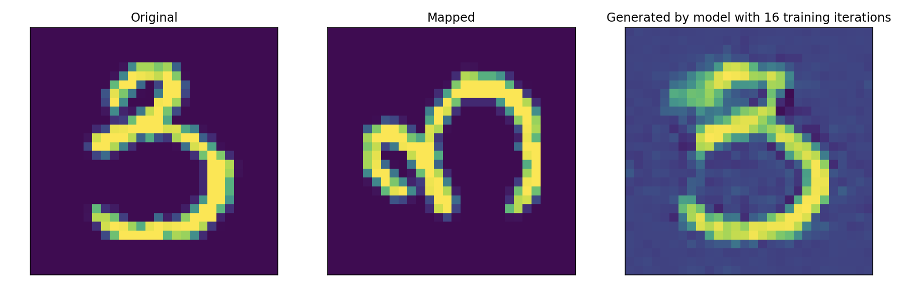

# sargan
Generative adversarial networks for real-time recovering grossly corrupted synthetic aperture radar (SAR) data.

The framework can be extended to learn various types of degrading operators. Below is an initial result for learning rotation operators:

